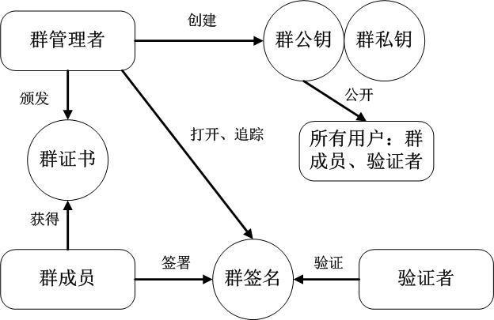

# Achieve anonymity-yet-accoutability in blockchain-based VANET systems by using group signature

### workflow

```
+----------------------------------------------------------------------------------------+

gpk: group public key
gsk: group secret key
gsk_ra: group secret key of RA
gsk_ve: group secret key of vehicle
pk_ve: public key of vehicle

+----------------------------------------------------------------------------------------+

+------+  create group: param  +------+
|      | +-------------------> |      |
|  RA  |                       |  RA  |
|      | <-------------------+ |      |
+------+  gpk, gsk, gsk_ra     +------+

+---------+  join group: gpk, pk_ve  +------+
|         | +----------------------> |      |
| vehicle |                          |  RA  |
|         | <----------------------+ |      |
+---------+  gsk_ve                  +------+

+---------+  sign message and post transaction  +------------+
|         | +---------------------------------> |            |
| vehicle |                                     | blockchain |
|         | <---------------------------------+ |            |
+---------+  return OK                          +------------+

+-------+  verify signature of message  +------------+
|       | +---------------------------> |            |
|  RSU  |                               | blockchain |
|       | <---------------------------+ |            |
+-------+  return OK                    +------------+

+------+  reveal someone's real identity by signature  +------------+
|      | +-------------------------------------------> |            |
|  RA  |                                               | blockchain |
|      | <-------------------------------------------+ |            |
+------+  pk_ve                                        +------------+
```

### group signature



### performance

The experiment setting is that using a virtual machine (VM) `ubuntu16.04` running on VirtualBox, the number of VM's CPU core is 2, the size of memory is 4GB; The localhost CPU is Intel i7-7700, the size of memory is 16GB.

- [test_group_signature](./test_group_signature.log)
- [test_ring_signature](./test_ring_signature.log)

> Note that maximum ring size is hard coded as 32 in [group-signature-server](https://github.com/FISCO-BCOS/group-signature-server/). In order to test a larger ring size, here I set it to 1024.